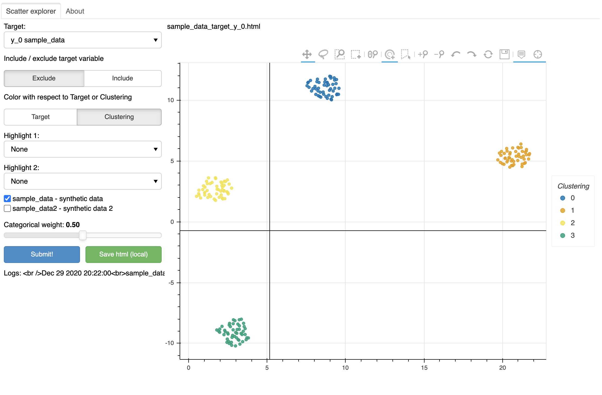

## brief description

Example of dashboard with bokeh.
Now run on synthetic datasets inside `bokeh_dashboard/features`

The dataset are created using `bokeh_dashboard/data_generator`, using scikit learn `make_blobs` function

## get started
Use environment.yml to create conda env
run with `bokeh serve --show main.py`

Select one of the datasets: `sample_data` or `sample_data2`
Press the **submit** button to render the visualization

If everything is ok, should return something like this..

